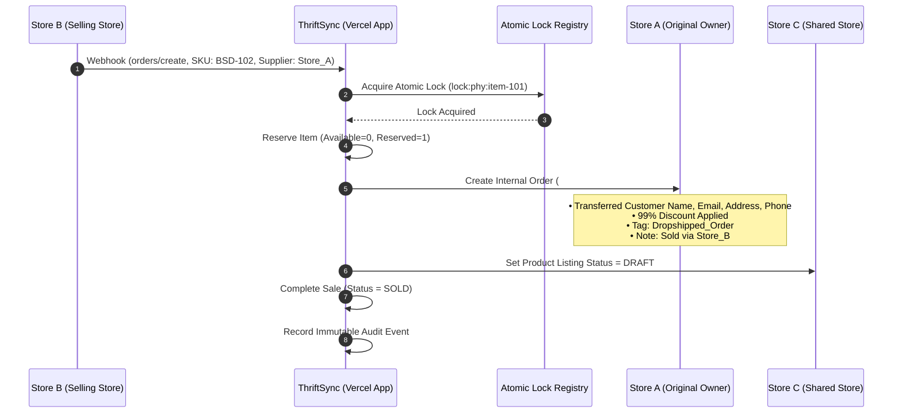
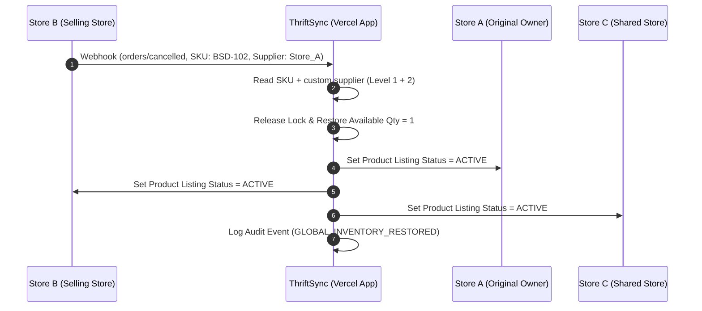

# ThriftSync

> **Multi-Store Thrift Inventory Sync, Atomic Reservation & Dropship Order Platform for Shopify**

ThriftSync is a multi-store shared inventory platform designed specifically for independent thrift and vintage clothing stores. It solves one primary problem: **ensuring that a single-piece physical thrift item shared across multiple Shopify stores can only be sold once**, preventing overselling, maintaining inventory ownership, and managing internal dropship order synchronization.

---

## 📋 Table of Contents

- [Core Business Rules](#-core-business-rules)
- [Real-Time Workflows](#-real-time-workflows)
  - [1. Real-Time Cross-Store Sale Workflow](#1-real-time-cross-store-sale-workflow)
  - [2. Global Order Cancellation Workflow](#2-global-order-cancellation-workflow)
- [Architecture & Tech Stack](#-architecture--tech-stack)
- [Directory Structure](#-directory-structure)
- [Prerequisites](#-prerequisites)
- [Installation & Setup Guide](#-installation--setup-guide)
- [Shopify API & Webhook Configuration](#-shopify-api--webhook-configuration)
  - [1. Obtaining Shopify Admin API Access Token](#1-obtaining-shopify-admin-api-access-token)
  - [2. Configuring Shopify Webhooks](#2-configuring-shopify-webhooks)
  - [3. Where to Put Credentials](#3-where-to-put-credentials)
- [Application Usage & Navigation](#-application-usage--navigation)
- [Vercel Deployment Guide](#-vercel-deployment-guide)

---

## 🎯 Core Business Rules

1. **Primary Business Axiom**:
   > **One physical thrift item = One available sale.**
2. **Three-Level Product Identity Matching**:
   - **Level 1 (SKU)**: Item SKU (e.g., `BSD-102`).
   - **Level 2 (Supplier Metafield)**: `custom.supplier` (e.g., `Store_A`).
   - **Level 3 (Explicit Physical Item Link)**: Unique central `PhysicalItemId`.
   - *Rule*: Store A (`BSD-102` + `Store_A`) and Store C (`BSD-102` + `Store_C`) are recognized as **two separate physical items** because their supplier metafields differ.
3. **Atomic Reservation Locking**:
   - Locks physical item server-side immediately upon purchase to prevent race conditions when two stores receive sales for the exact same item at the same millisecond.
4. **99% Internal Dropship Discount & Order Tagging**:
   - Internal orders created on the original store receive a **99% discount** and the mandatory tag: `Dropshipped_Order` with order note `Sold by: Store_B`.
5. **Global Instant Kill Switch (Store Unpublishing)**:
   - When sold, linked listings on third-party stores (e.g., Store C) are automatically set to `DRAFT` / 0 quantity.

---

## ⚡ Real-Time Workflows

### 1. Real-Time Cross-Store Sale Workflow



### 2. Global Order Cancellation Workflow



---

## 🛠 Architecture & Tech Stack

- **Framework**: [Next.js 15](https://nextjs.org/) (App Router, TypeScript)
- **Styling**: Vanilla Tailwind CSS v3.4 + Glassmorphism Dark Theme + Lucide Icons
- **State Repository**: In-Memory & Persistent State Repository (`src/lib/store-data.ts`)
- **Engine Architecture**:
  - `InventoryEngine`: SKU + `custom.supplier` identity resolution & server-side atomic mutex locking.
  - `OrderSyncEngine`: Cross-store 99% discount order creation & global cancellation reactivation.
  - `WebhookEngine`: Webhook verification, HMAC signature validation, and idempotency duplicate rejection.
- **Deployment Target**: [Vercel](https://vercel.com/) with server-side secrets protection.

---

## 📂 Directory Structure

```text
ThriftSync/
├── MASTER_SPEC.md              # Master Application Specification
├── README.md                   # Application Documentation & Guide
├── .env.example                # Environment Variables Configuration Template
├── .gitignore                  # Git Ignore Configuration (.env, node_modules, .next)
├── next.config.mjs             # Next.js Config with Output Tracing & Image Patterns
├── tailwind.config.ts          # Tailwind Theme & Styling Tokens
├── tsconfig.json               # TypeScript Compiler Config
├── package.json                # Project Dependencies
└── src/
    ├── types/
    │   └── index.ts            # Domain Interfaces (PhysicalItem, Store, Reservation, Order, SyncJob, AuditLog)
    ├── lib/
    │   ├── store-data.ts       # Central Repository with Demo Data & Immutable Audit Logger
    │   ├── inventory-engine.ts # Level 1, 2, 3 Matching & Atomic Reservation Locking Engine
    │   ├── order-sync-engine.ts# 99% Discount Dropship Order & Cancellation Restoration Engine
    │   └── webhook-engine.ts   # Webhook Verification & Idempotency Duplicate Detection
    ├── components/
    │   ├── Navigation.tsx      # Sidebar Navigation & Engine Status Indicator
    │   └── Header.tsx          # Global Search, Notifications & Demo Reset Button
    └── app/
        ├── layout.tsx          # Root Layout
        ├── page.tsx            # Operational Dashboard
        ├── stores/             # Store Management Page (Connect/Disconnect Stores & Supplier Codes)
        ├── shared-inventory/   # Master Physical Item Catalog & Identity Inspector
        ├── reservations/       # Real-Time Atomic Reservation Lock Registry
        ├── orders/             # Cross-Store Orders Page (99% Discount & Dropshipped_Order Tag)
        ├── sync-history/       # Sync Operations Execution Log & Payload Inspector
        ├── errors/             # Dedicated Error Resolution Queue & Safe Idempotent Retries
        ├── audit-log/          # Immutable System Audit Trail
        ├── simulator/          # Live Webhook & Race Condition Interactive Testing Playground (Scenarios 1-4)
        ├── settings/           # System Parameters & Security Safeguards
        └── api/                # REST & Webhook Ingestion API Endpoints
            ├── webhooks/
            ├── stores/
            └── inventory/
```

---

## 💻 Prerequisites

- **Node.js**: `v18.0.0` or higher (`v24.x` recommended)
- **npm**: `v9.x` or higher (`v11.x` recommended)
- **Shopify Stores**: 2 or more Shopify stores with custom app access (for live store integration).

---

## 🚀 Installation & Setup Guide

### 1. Clone the Repository
```bash
git clone https://github.com/RashidKhaliq/ThriftSync.git
cd ThriftSync
```

### 2. Install Dependencies
```bash
npm install
```

### 3. Configure Environment Variables
Copy `.env.example` to `.env.local`:
```bash
cp .env.example .env.local
```

Edit `.env.local`:
```env
APP_URL=http://localhost:3000
NODE_ENV=development
DATABASE_URL=file:./dev.db
AUTH_SECRET=your_super_secret_auth_key_change_in_production
WEBHOOK_SECRET=thrift_sync_whsec_999888777666555
```

### 4. Run Development Server
```bash
npm run dev
```
Open [http://localhost:3000](http://localhost:3000) in your browser.

### 5. Build for Production
```bash
npm run build
npm run start
```

---

## 🔑 Shopify API & Webhook Configuration

### 1. Obtaining Shopify Admin API Access Token

To connect a Shopify store (Store A, Store B, Store C, etc.) to ThriftSync:

1. Log in to your **Shopify Admin** dashboard (`https://your-store.myshopify.com/admin`).
2. Go to **Settings** > **Apps and sales channels** > **Develop apps**.
3. Click **Create an app** and name it `ThriftSync Integration`.
4. Click **Configure Admin API scopes** and grant the following permissions:
   - `write_products`, `read_products` (To update product inventory, set draft status)
   - `write_orders`, `read_orders` (To create internal dropship orders with 99% discount)
   - `write_inventory`, `read_inventory` (To adjust stock levels)
   - `read_customers` (To read customer shipping info)
5. Click **Save** and then click **Install app**.
6. Reveal and copy the **Admin API Access Token** (begins with `shpca_...` or `shpat_...`).

---

### 2. Configuring Shopify Webhooks

To receive real-time order notifications in ThriftSync:

1. In Shopify Admin, go to **Settings** > **Notifications**.
2. Scroll down to the **Webhooks** section and click **Create webhook**.
3. Create the following webhooks:

| Event | Format | URL Endpoint | API Version |
|---|---|---|---|
| **Order creation** | `JSON` | `https://your-thriftsync-app.vercel.app/api/webhooks` | Latest (2026-01 or later) |
| **Order cancellation** | `JSON` | `https://your-thriftsync-app.vercel.app/api/webhooks` | Latest |
| **Product update** | `JSON` | `https://your-thriftsync-app.vercel.app/api/webhooks` | Latest |
| **Inventory update** | `JSON` | `https://your-thriftsync-app.vercel.app/api/webhooks` | Latest |

4. Copy the **Webhook Secret Key** shown at the bottom of the Webhooks section in Shopify.

---

### 3. Where to Put Credentials

#### A. Global Application Secret (`.env.local` or Vercel Environment Variables)
Put the **Webhook Secret Key** in your `.env.local` file or Vercel Environment Variables:
```env
WEBHOOK_SECRET=your_shopify_webhook_secret_here
```

#### B. Individual Store API Keys (ThriftSync Dashboard)
Add connected store API tokens directly inside the ThriftSync app UI:
1. Open ThriftSync and navigate to **Stores** (`/stores`).
2. Click **Connect New Store**.
3. Enter:
   - **Store Name**: e.g., `Store A (Boutique Thrift)`
   - **Shopify Domain**: e.g., `store-a-thrift.myshopify.com`
   - **Supplier Code (`custom.supplier`)**: e.g., `Store_A`
   - **API Token**: Paste the `shpca_...` Admin API Access Token.

---

## 🖥 Application Usage & Navigation

### 1. Dashboard (`/`)
- View operational overview metrics: Total Stores, Connected Stores, Shared Products, Available Inventory, Reserved Items, and Sold Items.
- Inspect the live **Enforced Business Rules Banner** and **Sync Engine Activity Feed**.

### 2. Stores (`/stores`)
- Connect 2 or 20+ Shopify stores dynamically.
- Manage supplier codes (`Store_A`, `Store_B`, `Store_C`), check connection health, or pause sync.

### 3. Shared Inventory (`/shared-inventory`)
- View central **Physical Item Source of Truth**.
- Filter by status (`AVAILABLE`, `RESERVED`, `SOLD`, `UNAVAILABLE`).
- Inspect identity levels (Level 1 SKU, Level 2 Supplier, Level 3 Shared Link) or share/unshare items across stores.

### 4. Reservations (`/reservations`)
- Inspect active server-side **Atomic Reservation Locks**.
- View lock timestamp, customer details, and execute safe manual lock releases if necessary.

### 5. Orders (`/orders`)
- View synchronized dropship orders.
- Verify **99% discount** badge, exact tag **`Dropshipped_Order`**, transferred customer email, and `Sold by: Store_B` notation.

### 6. Sync History (`/sync-history`)
- Complete audit log of synchronization jobs.
- Inspect raw JSON request/response payloads for any transaction.

### 7. Errors Queue (`/errors`)
- Dedicated error resolution queue.
- Execute **Idempotent Safe Retries** with one click without creating duplicate orders or reservations.

### 8. Audit Log (`/audit-log`)
- Immutable system audit trail recording every state change, store connection, lock acquisition, and sale.

### 9. Webhook Simulator (`/simulator`)
- Interactive testing playground to trigger live scenarios:
  - **Scenario 1**: Cross-Store Dropship Sale.
  - **Scenario 2**: Concurrent Race Condition (Store B vs Store C buying same item simultaneously).
  - **Scenario 3**: Duplicate Webhook Idempotency Rejection.
  - **Scenario 4**: Order Cancellation & Global Re-activation across all connected stores.

---

## ☁️ Vercel Deployment Guide

1. Push your repository to GitHub:
   ```bash
   git add .
   git commit -m "Deploying ThriftSync"
   git push origin main
   ```
2. Import your GitHub repository into [Vercel](https://vercel.com/new).
3. Set the Environment Variables in Vercel project settings:
   - `APP_URL`: `https://your-thriftsync-app.vercel.app`
   - `WEBHOOK_SECRET`: Your Shopify webhook signature key
   - `AUTH_SECRET`: Your production authentication secret key
4. Click **Deploy**. Vercel will build the Next.js App Router project automatically.